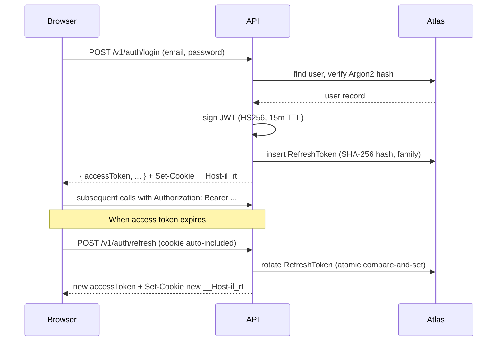

# System Overview

A high-level view of how India Learns is put together: components, where they run, and how they talk. New engineers should be able to read this in 10 minutes and have a working mental model.

For deeper detail, follow the references at the end of each section.

## 1. C4 Level 1 — System context

Who uses it and what it talks to.

```mermaid
flowchart LR
    Student[Student\nbrowser/PWA]
    Faculty[Faculty\nbrowser]
    Admin[Admin / Finance / Superadmin\nbrowser]
    Cron[Render cron jobs\n(5 schedules)]

    IL[India Learns\nweb service\n(Express API + React SPA)]

    Atlas[(MongoDB Atlas\nMumbai ap-south-1)]
    Cloud[Cloudinary]
    Mail[Resend / SendGrid / Brevo]
    WABA[Meta WhatsApp Business\n(stub by default)]
    Cert[Certifier.io\n(stub by default)]
    Sentry[Sentry]

    Student -->|HTTPS| IL
    Faculty -->|HTTPS| IL
    Admin -->|HTTPS| IL
    Cron -->|HTTPS + HMAC| IL

    IL --> Atlas
    IL --> Cloud
    IL --> Mail
    IL --> WABA
    IL --> Cert
    IL --> Sentry

    Student -.->|signed PUT| Cloud
```

The same Render Node service serves the API (under `/v1`, `/health*`) and the React SPA (everything else). This single-origin deployment removes CORS and cross-site cookie complications.

## 2. C4 Level 2 — Containers

Inside the Render web service:

```mermaid
flowchart TB
    subgraph Render
        SPA[React 18 SPA\n(Vite + Tailwind, served\nstatic from web/dist)]
        API[Express API\n/api/dist/index.js]
        SW[Kill-switch\nservice worker /sw.js]
    end

    subgraph Atlas
        Mongo[(39 MongoDB collections)]
    end

    Browser -->|GET /| SPA
    Browser -->|GET /assets/...| SPA
    Browser -->|POST /v1/...| API
    Browser -->|GET /sw.js| SW

    API --> Mongo
    API --> Cloudinary
    API --> Mail
    API --> WABA
    API --> Cert
    API --> SentryServer[Sentry — server SDK]
    SPA --> SentryWeb[Sentry — web SDK]
```

Why single-service:

- **One URL** — frontend and API share the Render origin.
- **No CORS** — the SPA fetches the API on the same origin.
- **Cookies stay same-origin** — `__Host-il_rt` works without cross-site complications.
- **Simpler ops** — one deploy unit, one log stream, one health check.

The kill-switch service worker at `/sw.js` exists to rescue users stuck on a stale cached PWA build by unregistering the old SW and forcing a reload — see [`api/src/app.ts`](../../api/src/app.ts).

## 3. Stack

### Backend

- **Runtime:** Node.js 20 LTS (`20.12.2` pinned in CI).
- **Framework:** Express 4.
- **DB:** Mongoose 8 → MongoDB 7 on Atlas.
- **Validation:** zod 3.
- **Auth crypto:** `argon2`, `jose` (JWT), `crypto.createHmac` (cron HMAC).
- **Logging:** pino + pino-http with structured request IDs.
- **Errors:** @sentry/node 8.
- **PDFs:** pdfkit (for receipts).
- **Tests:** Vitest + supertest + mongodb-memory-server.

### Frontend

- **Framework:** React 18.
- **Build:** Vite 5.
- **Styling:** Tailwind 3 + Poppins font.
- **State:** Zustand (auth) + TanStack Query (server state).
- **Routing:** React Router 6.
- **HTTP:** axios.
- **PWA:** `vite-plugin-pwa` + workbox.
- **Forms:** react-hook-form.
- **Drag-drop:** @dnd-kit.
- **Errors:** @sentry/react.
- **Tests:** Playwright + axe-core.
- **Charts:** Recharts.

### Hosting

- **Render** — Standard plan single web service in Singapore + 5 cron jobs.
- **MongoDB Atlas** — cluster in AWS Mumbai (ap-south-1).
- **Cloudinary** — file storage.

See [../../claude-code-docs/03_TRD.md](../../claude-code-docs/03_TRD.md) for the locked stack rationale.

## 4. Authentication and session model



Detail in [../security/cryptography.md](../security/cryptography.md) and [../security/access-control.md](../security/access-control.md).

## 5. Cron architecture

```mermaid
flowchart LR
    R[Render cron] -->|sign-job-jwt.mjs\n+ HMAC SHA256\n+ x-job-timestamp| API[/v1/jobs/...]
    API --> Mongo[(Atlas)]
    API --> Mail
    API --> WABA
```

5 schedules in [`render.yaml`](../../render.yaml):

- `il-cron-fee-reminders` — daily 03:00 UTC (08:30 IST).
- `il-cron-autosuspend` — daily 22:00 UTC (03:30 IST).
- `il-cron-sla-timers` — every 15 minutes.
- `il-cron-faculty-digest` — Mon 03:30 UTC (09:00 IST).
- `il-cron-notifications-retry` — every 15 minutes.

Each cron service runs `node scripts/sign-job-jwt.mjs <name>` which signs the request and POSTs to the API. The `requireJobAuth` middleware verifies the HMAC and replay window. See [../security/cryptography.md](../security/cryptography.md) §5.

## 6. Integrations adapter pattern

Every external service is behind an interface in `india-learns-shared-types` and has at least two implementations: a **stub** for dev/test and a **live** implementation for production.

```mermaid
flowchart TB
    Service[business service\n(notificationService.ts)]
    Service --> Adapter[email adapter interface]
    Adapter --> Resend[ResendEmailAdapter]
    Adapter --> SendGrid[SendGridEmailAdapter]
    Adapter --> Brevo[BrevoEmailAdapter]
    Adapter --> Stub[ConsoleEmailAdapter]

    Selector[integrations/index.ts] -.builds.-> Adapter
```

Selection happens in [`api/src/integrations/index.ts`](../../api/src/integrations/index.ts) based on env (`EMAIL_PROVIDER`, `STORAGE_PROVIDER`, `INTEGRATIONS_MODE`, etc.).

Detail in [integrations.md](integrations.md).

## 7. Data model bird's-eye

39 MongoDB collections grouped:

| Group | Collections |
|---|---|
| Identity | `User`, `RefreshToken`, `InviteToken`, `Session` |
| Academic structure | `Program`, `Course`, `Module`, `Material`, `Batch`, `Holiday`, `TimetableEntry`, `TimetableOverride`, `Session`, `Announcement` |
| Enrolment + delivery | `Enrollment`, `AttendanceRecord` |
| Assessments | `Quiz`, `QuizAttempt`, `Exam`, `ExamAttempt`, `Assignment`, `AssignmentSubmission`, `Rubric`, `FeedbackEntry` |
| Finance | `FeeStructure`, `FeeInstallment`, `Invoice`, `Payment`, `Receipt`, `CreditNote` |
| Support | `Ticket`, `TicketComment` |
| Notifications | `Notification`, `NotificationPrefs` |
| Audit & ops | `AuditLog`, `DomainEvent`, `ApiCostLedger`, `Counter` |

Detail in [data-model.md](data-model.md).

## 8. Conventions

- **TypeScript everywhere** (api, web, shared types).
- **ESM** — every module is `type: module`.
- **Money as integer paise** in fields named `*Paise`. Display via `Intl.NumberFormat('en-IN')`. See ADR [`adrs/0006-money-as-integer-paise.md`](adrs/0006-money-as-integer-paise.md).
- **Times in UTC** in DB; rendered in `Asia/Kolkata` (IST) in the UI via `date-fns-tz`.
- **IDs** — Mongo `_id` exposed to clients as `id` string. Human-readable codes on User (`IL-YYYY-NNNN`), Invoice (`INV-YYYY-NNNNNN`), Ticket (`TKT-CAT-NNNNNN`), Receipt (`RCP-YYYY-NNNNNN`).
- **Error envelope** — `{ error: { code, message, details? } }` with correct HTTP status. See [`api/src/middleware/error.ts`](../../api/src/middleware/error.ts).
- **Audit on every staff write.** Mandatory for admin / finance / superadmin / faculty actions.

## 9. Where to read more

- [data-model.md](data-model.md) — every collection with key fields and indices.
- [api-reference.md](api-reference.md) — endpoint catalog.
- [integrations.md](integrations.md) — adapter pattern + per-provider notes.
- [adrs/](adrs/) — significant decisions.
- [../security/threat-model.md](../security/threat-model.md) — what we defend against per boundary.
- [../../claude-code-docs/03_TRD.md](../../claude-code-docs/03_TRD.md) — original technical spec.

_Last reviewed: 2026-04-26 — Owner: Vidit Bhatnagar. Review cadence: per major architectural change._
