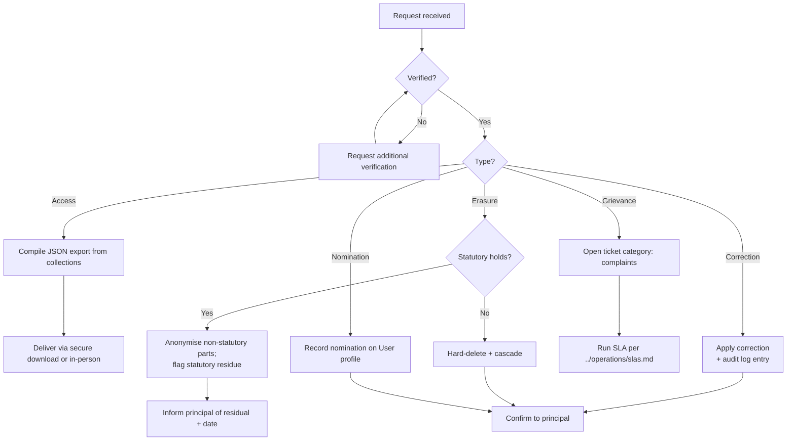

# Data Subject Access Request (DSAR) Procedure

How India Learns receives, verifies, fulfils, and records requests under DPDP Act 2023 §§ 11–14:

- **§ 11** — right to access summary of personal data
- **§ 12** — right to correction and erasure
- **§ 13** — right of grievance redressal
- **§ 14** — right to nominate

> **Status:** Procedure is operational and manual today. A self-service export endpoint and a "delete my account" UI are tracked as Phase 2 features (see [dpdp-compliance-report.md](dpdp-compliance-report.md) §2).

## 1. Channels for receiving requests

A request is valid through any of:

- The in-app **support ticket** with category `data_request` (preferred — keeps auth context).
- An email to `{{DPO_EMAIL}}` (placeholder until DPO designation — fall-back to `intern@learnerseducation.com` with prefix `[DSAR]`).
- A written letter to the DPO at the registered address (rare in practice).

Phone-only requests are not honoured because identity cannot be verified by phone alone.

## 2. Identity verification

The Act does not prescribe a verification method, but warns that fulfilling a request to the wrong person is itself a privacy breach. Our default ladder:

1. **In-app authenticated channel** — request comes via a logged-in session. The session is the verification.
2. **Email channel** — match the email to a registered user; reply asks for login from the registered email and confirmation in-app, OR for two of (last 4 digits of an instalment paid, the IL student code, the registered phone last 4 digits).
3. **In-person at LUC** — government photo ID is verified by LUC operations and a written request signed.

If verification fails, the request is held but not refused; we re-prompt with the next escalation. Documented refusals are tracked.

## 3. Response timelines

| Right | Target response time |
|---|---|
| Access (§ 11) | **15 working days** from verified request |
| Correction (§ 12) | **15 working days** |
| Erasure (§ 12) | **15 working days** for confirmation; physical erasure may take up to **30 days** to propagate through subprocessors and backups roll-off |
| Grievance (§ 13) | Acknowledgement within 24h; resolution per ticket SLA in [../operations/slas.md](../operations/slas.md) |
| Nomination (§ 14) | **5 working days** to record |

If we cannot meet a target, we inform the data principal in writing and explain why.

## 4. Request workflow



## 5. Access (§ 11) — compiling the export

Until a self-service endpoint is built, an authorised support staff (DPO or delegate) runs a manual script per collection. The export bundle is structured as JSON, one file per collection where the principal has data. Excluded by default:

- `passwordHash`, `passwordHistoryHashes`, `loginFailCount`, `lockedUntil` — never disclosed.
- Internal-only fields in `TicketComment` (`isInternal: true`) — not the principal's data; these are staff notes.
- `AuditLog` rows where the principal is the *target* — included; rows where the principal is the *actor* — included.
- Other users' data — excluded.

Format:

```json
{
  "exportRequestId": "<uuid>",
  "principal": { "id": "<userId>", "email": "<email>", "name": "<name>" },
  "exportedAt": "<ISO-8601 UTC>",
  "collections": {
    "user": { ... },
    "enrollment": [ ... ],
    "invoice": [ ... ],
    "payment": [ ... ],
    "receipt": [ ... ],
    "ticket": [ ... ],
    "ticketComment": [ ... ],  // public comments by/to principal only
    "quizAttempt": [ ... ],
    "examAttempt": [ ... ],
    "assignmentSubmission": [ ... ],
    "feedbackEntry": [ ... ],
    "notification": [ ... ],
    "notificationPrefs": { ... },
    "auditLog": [ ... ]  // where actor or target is principal
  }
}
```

Delivered via:

- A signed Cloudinary download URL with TTL = 72 hours, OR
- An in-person handover on a USB at LUC offices when the principal prefers no electronic delivery.

We log the export in the audit trail (`dsar.exported`) and retain the audit row per the standard 7-year audit retention.

## 6. Correction (§ 12)

Corrections to fields that the user can edit themselves (`name`, `phoneE164`, `address`, `notificationPrefs`) should be self-served. The DSAR channel handles:

- Correcting fields not in the self-edit UI (e.g., programme/batch link, role, name spelling on a certificate).
- Disputed fields where the staff record disagrees with the principal's claim — escalates to LUC ops.

Every correction produces an audit entry (`user.updated` or model-specific) with `before`/`after` (PII-scrubbed for password fields). The principal is notified of the change.

## 7. Erasure (§ 12)

The erasure flow follows [data-retention-policy.md](data-retention-policy.md) §2.2:

1. Identity verified.
2. DPO determines whether statutory retention applies. **Financial records (receipts, invoices, payments) cannot be hard-deleted within 8 years of issue** under Indian tax record-keeping conventions; they are anonymised instead.
3. Non-statutory data is hard-deleted: `User`, `Notification`, recent `Ticket` (older than dispute window), `RefreshToken` family, etc.
4. Statutory data is anonymised: `studentId` → tombstone token, `name`/`address` → "ANONYMISED", invoice/payment/receipt amounts retained for tax.
5. Cloudinary assets linked to the principal (receipts, materials uploaded by them, ticket attachments) are deleted via `storageAdapter.delete(key)`.
6. Audit log entries about the principal are anonymised (per [data-retention-policy.md](data-retention-policy.md) §4.1).
7. Backups rolling off — the principal is informed that backup snapshots up to 30 days old still contain their records. See [../operations/backup-and-dr.md](../operations/backup-and-dr.md).

The principal is informed in writing of the categories of data erased, the categories anonymised, the residual statutory categories with dates of eventual deletion, and the backup window.

## 8. Grievance (§ 13)

A grievance is filed as a ticket with category `complaints`. The Phase 1 SLA is 15 business days for resolution per PRD §9.4. Escalation path to the DPDP Board is documented in [../legal/privacy-policy.md](../legal/privacy-policy.md).

## 9. Nomination (§ 14)

A Data Principal may nominate another individual to exercise rights on their behalf in the event of death or incapacity. Today this is captured as a free-text field on the User record by support staff and acknowledged in writing. A formal field on the model + UI is a Phase 2 candidate.

## 10. Records and reporting

- Every DSAR is logged with `dsar.received`, `dsar.verified`, and a terminating event (`dsar.access_fulfilled`, `dsar.correction_applied`, `dsar.erasure_completed`, `dsar.grievance_resolved`, or `dsar.refused`).
- The DPO publishes a quarterly summary (counts per type, average fulfilment time, refusals + reasons) to LUC leadership.
- Refusals must be in writing with the reason and the appeal mechanism.

## 11. Cross-references

- [dpdp-compliance-report.md](dpdp-compliance-report.md) §§ 11–14
- [data-retention-policy.md](data-retention-policy.md) §2.2 — erasure rules
- [data-classification.md](data-classification.md) — what counts as personal data
- [../operations/backup-and-dr.md](../operations/backup-and-dr.md) — backup roll-off
- [../legal/privacy-policy.md](../legal/privacy-policy.md) — public-facing description of the same rights

_Last reviewed: 2026-04-26 — Owner: Vidit Bhatnagar (interim DPO). Review cadence: per quarter and on any new collection or subprocessor._
