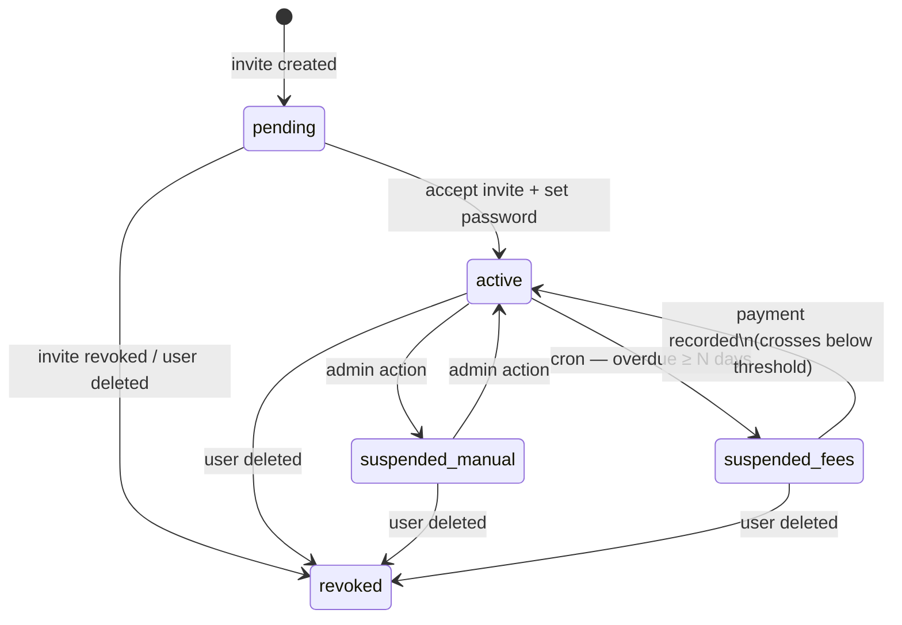

# Access Control

This document describes how India Learns enforces authentication and authorisation, the role model, the suspension state machine, and the audit trail. Everything claimed here is verifiable against the source files cited inline.

## 1. Identity and authentication

A request is authenticated if and only if it presents a valid HS256 JWT in the `Authorization: Bearer …` header that:

- is signed with `JWT_SECRET` (≥ 32 bytes in production — enforced in [`api/src/config/env.ts:assertProdSecrets`](../../api/src/config/env.ts));
- has `iss=il`, `aud=web`, an unexpired `exp`, and a `sub` resolving to a non-deleted, non-revoked user.

See [`api/src/services/tokenService.ts:verifyAccessToken`](../../api/src/services/tokenService.ts) and [`api/src/middleware/auth.ts:requireAuth`](../../api/src/middleware/auth.ts).

Refresh is a separate flow: an opaque token in the `__Host-il_rt` cookie ([`api/src/utils/cookies.ts`](../../api/src/utils/cookies.ts)) is rotated on every call to `/v1/auth/refresh`. Reuse of an already-revoked refresh token revokes the entire token family ([`api/src/services/refreshTokenService.ts:rotateRefreshToken`](../../api/src/services/refreshTokenService.ts)). Logout revokes the presented token ([`refreshTokenService.ts:revokeRefreshToken`](../../api/src/services/refreshTokenService.ts)). Password reset and password change revoke *all* refresh tokens for the user via `revokeAllForUser` — this is the de-facto "log me out everywhere" operation.

**Session cap:** at most 5 concurrent refresh tokens per user (`SESSION_CAP=5` default). The oldest is evicted on issue. Override per-user via the `User.sessionCap` field.

## 2. Roles

The role enum is `admin | superadmin | finance | faculty | student` ([`api/src/models/user.ts`](../../api/src/models/user.ts)). Roles are mutually exclusive — a user has exactly one role.

| Role | Description | Notable abilities |
|---|---|---|
| `superadmin` | The vendor-side and a single LUC operator. | Everything `admin` can do, plus role assignment, permanent deletes, audit-log retention edits. |
| `admin` | LUC academic operations. | User CRUD (except role escalation), program/course/batch/timetable CRUD, ticket triage, fee structures, holidays, curriculum import. |
| `finance` | LUC finance team. | Record payments, issue receipts, reverse payments (with audit), view collections analytics, override fee suspension. |
| `faculty` | Teaching staff. | View and grade their assigned courses, manage announcements/materials/sessions on those courses, see their personal timetable. |
| `student` | Enrolled learners. | View their own dashboard, courses, modules, timetable, fees, tickets, certificates; submit quiz/exam attempts; raise tickets and feedback. |

The full permission matrix (exhaustive per-feature) is in [02_PRD.md §3.1](../../claude-code-docs/02_PRD.md). Code-level enforcement happens via `requireRole(...)` on each route, plus owner checks inside services (a student cannot read another student's data even if both have role `student`).

## 3. Status and suspension

The user-status enum is `pending | active | suspended | revoked` ([`api/src/models/user.ts`](../../api/src/models/user.ts)). When `status === 'suspended'`, the discriminator `suspensionKind` is `manual` or `fees`.



Behavior at each state:

- **`pending`** — Cannot log in (gate in [`authService.ts:login`](../../api/src/services/authService.ts)). Refresh blocked too. The only meaningful action is consuming an invite token via `acceptInvite`.
- **`active`** — Normal access subject to role.
- **`suspended` + `manual`** — Hard block on login and on every authenticated route. Returns `403 SUSPENDED_ACCESS`. Set/cleared by admin via [`api/src/routes/users.ts`](../../api/src/routes/users.ts) and [`api/src/routes/suspensionOverride.ts`](../../api/src/routes/suspensionOverride.ts).
- **`suspended` + `fees`** — Login allowed; non-whitelisted routes return `403 FEES_SUSPENDED`. Set automatically by the autosuspend cron ([`render.yaml`](../../render.yaml) cron `il-cron-autosuspend`); cleared automatically by `paymentService` once the outstanding balance falls below threshold (see PRD §9.4 / 9.5 and [02_PRD.md](../../claude-code-docs/02_PRD.md)). Can also be temporarily overridden by an admin via `POST /v1/users/:id/suspension-override`.
- **`revoked`** — Soft-deleted. Access tokens fail `requireAuth` because the user is filtered out. Refresh tokens are revoked on revoke. Email is preserved so re-invite is impossible without an explicit admin action.

### Fees-suspension whitelist (the live source of truth)

A fees-suspended student keeps a session and can hit a small set of routes so they can pay or talk to finance. The whitelist is encoded in [`api/src/middleware/auth.ts:feesSuspensionAllowed`](../../api/src/middleware/auth.ts):

| Method | Path pattern | Why |
|---|---|---|
| `GET` | `/students/me/fees` | View outstanding balance, instalment status |
| `GET` | `/students/me/dashboard` | Land on dashboard so the suspension banner renders |
| `GET` | `/users/me` | Render header avatar, role context |
| `POST` | `/auth/logout` | Sign out |
| `POST` | `/auth/refresh` | Keep session alive while paying |
| `*` | `/notifications/me`, `/me/notifications`, `/me/notification-prefs` | Read suspension warnings |
| `GET` | `/me/certificates` | Show prior credentials to employers — D-052 |
| `POST` | `/tickets` _with_ `category=finance` | Raise a Finance-category ticket only |
| `GET` | `/me/tickets`, `/tickets/me`, `/tickets/:id` | Read their own ticket thread |
| `POST` | `/tickets/:id/comments`, `/tickets/:id/reopen-request` | Continue the conversation |
| `POST` | `/payments` | Finance staff recording a payment for this student |
| `GET` | `/receipts/:id/download` | Download a receipt PDF |

> **Drift hazard.** A near-duplicate whitelist exists in [`api/src/middleware/requireNotSuspended.ts`](../../api/src/middleware/requireNotSuspended.ts) for routes that mount `requireNotSuspended` directly (rather than relying on the global guard inside `requireAuth`). When you add a new whitelisted route, update both. This duplication is tracked as a residual risk in [threat-model.md](threat-model.md) §8.5.

## 4. Permission enforcement layers

There are four layers, applied in order:

1. **`requireAuth`** ([`api/src/middleware/auth.ts`](../../api/src/middleware/auth.ts)) — verifies token, attaches `req.auth = { userId, role, status, user }`, hard-blocks `revoked` / soft-deleted / `pending` / manual-suspended, and applies the fees-suspension whitelist for `suspensionKind=fees`.

2. **`requireRole(...roles)`** ([`api/src/middleware/requireRole.ts`](../../api/src/middleware/requireRole.ts)) — returns 403 unless `req.auth.role` is in the allowed set.

3. **`requireNotSuspended`** ([`api/src/middleware/requireNotSuspended.ts`](../../api/src/middleware/requireNotSuspended.ts)) — belt-and-braces guard for routes that mount it explicitly.

4. **Service-layer ownership checks** — for any route that exposes user-scoped resources, the service queries with `userId === req.auth.userId` so a student cannot read another student's data even if the global role gate allows their role. Examples: `meCoursesRouter`, `myFeesRouter`, `meTicketsRouter`, `studentDashboardRouter`.

Routes that intentionally accept any authenticated user (e.g. `/users/me`, `/auth/logout`) skip step 2.

## 5. Audit trail

Every staff write produces an `AuditLog` row via [`recordAudit`](../../api/src/services/auditService.ts). The schema is in [`api/src/models/auditLog.ts`](../../api/src/models/auditLog.ts):

```ts
{ actorUserId, action, targetType, targetId, before, after, details, ip, ua, at }
```

- `actorUserId === null` for system-driven events (auth failures with unknown user, cron jobs).
- `before`/`after` are scrubbed via [`scrubUser`](../../api/src/services/auditService.ts) so password hashes and lockout fields never land in the log.
- Audit writes are non-blocking — a failed write logs `audit.write_failed` via Pino but does not fail the originating request. This is a deliberate trade-off (availability over completeness).

Indexed by `actorUserId+at`, `targetType+targetId+at`, `at`, so the common queries (per-user history, per-target history, recent firehose) are O(log n).

### Action codes

`AuditAction` is the enum in `india-learns-shared-types`. Common codes:

| Code | When | Recorded by |
|---|---|---|
| `auth.login.success` / `auth.login.failure` | Every login attempt | [`authService.ts`](../../api/src/services/authService.ts) |
| `auth.invite_accepted` | First-time password set from invite | `authService.ts:acceptInvite` |
| `auth.password_reset_requested` / `_confirmed` | Self-service flow | `authService.ts` |
| `auth.password_changed` | Logged-in change | `authService.ts:changePassword` |
| `auth.logout` | Sign-out | `authService.ts:logout` |
| `user.created` / `user.suspended` / `user.unsuspended` / `user.deleted` | Admin user management | `userService.ts` |
| `payment.recorded` / `payment.reversed` | Finance actions | `paymentService.ts` |
| `receipt.issued` | Receipt PDF generation | `receiptService.ts` |
| `enrollment.created` / `.completed` | Enrolment lifecycle | `enrollmentService.ts` |
| `fee.override` | Admin overrides fees suspension | `suspensionOverride.ts` |
| `ticket.transitioned` / `.assigned` / `.commented` | Ticket lifecycle | `ticketService.ts` |
| `assignment.published` / `submission.graded` | Grading lifecycle | `assignmentSubmissionService.ts` / `gradingService.ts` |
| `certificate.issued` | Cert flow | `certificateService.ts` |

## 6. Verifying access control in practice

| Verification | Command |
|---|---|
| All non-public route handlers are guarded | `rg "router\.(get\|post\|patch\|put\|delete)\(" api/src/routes -A 3 \| rg -B 4 "requireRole\|requireAuth\|requireJobAuth"` (each handler should appear with at least one of these immediately before/after) |
| No route emits `passwordHash` | `rg "passwordHash" api/src/routes` should return zero results — only models and services touch it |
| The fees whitelist matches between auth.ts and requireNotSuspended.ts | Manually compare the two files; checklist item in [secure-sdlc.md](secure-sdlc.md) |
| Audit triggers on a sensitive route | Hit a finance endpoint and grep `audit_logs` for the resulting row (see `paymentService.ts`) |

## 7. Known gaps and follow-ups

1. **No granular scoped permissions.** Every admin can do everything an admin can do. Spec is RBAC-only for Phase 1; ABAC/ACL is out of scope.
2. **Ownership checks are decentralised.** Each service reimplements "where userId = req.auth.userId". A central helper would reduce drift; tracked as a clean-up task.
3. **`logout-all-sessions` is implicit.** It happens on password change/reset (via `revokeAllForUser`), but there is no user-facing "Sign me out everywhere" button. Build is a separate ticket. (Note: the [plan file](../../.claude/plans/i-want-you-to-wondrous-quiche.md) initially flagged this as missing — the function exists, only the UI affordance is missing.)
4. **No just-in-time elevation.** Superadmin powers are always-on for the user holding that role.

_Last reviewed: 2026-04-26 — Owner: Vidit Bhatnagar. Review cadence: every release and after every role/route change._
